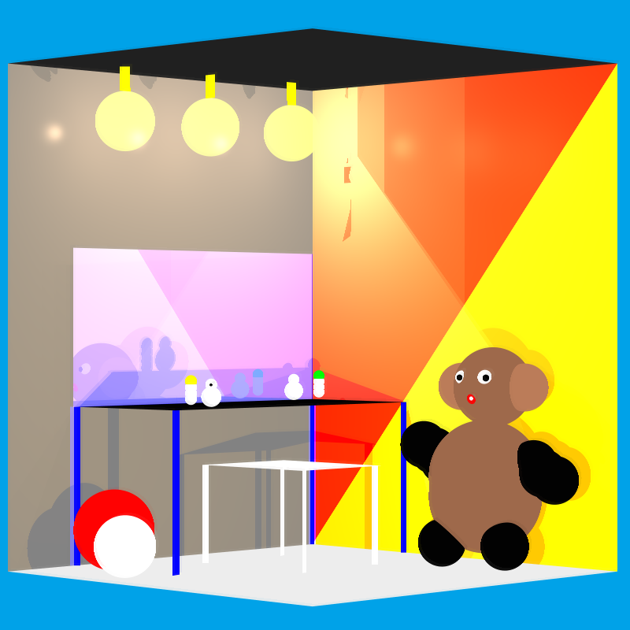
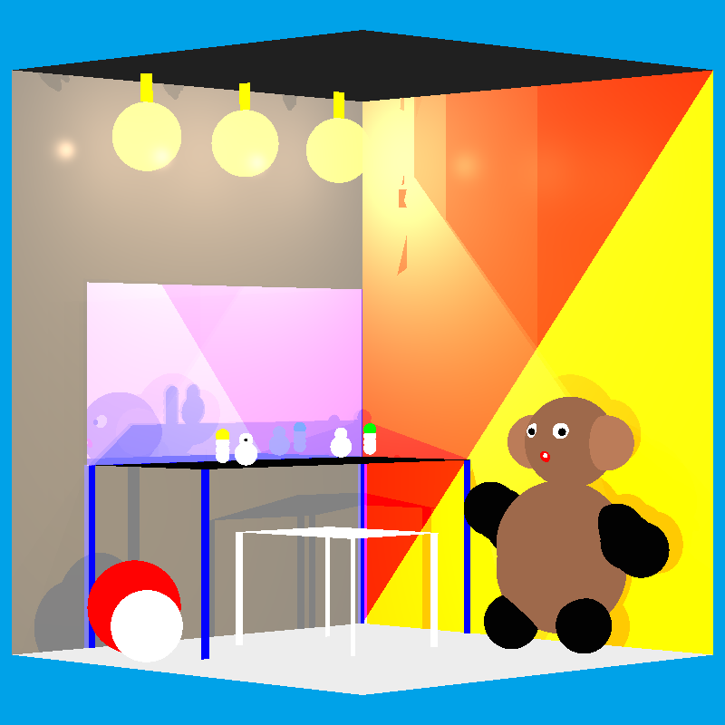
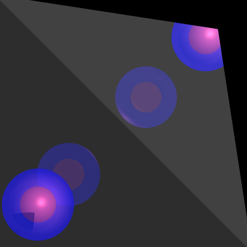
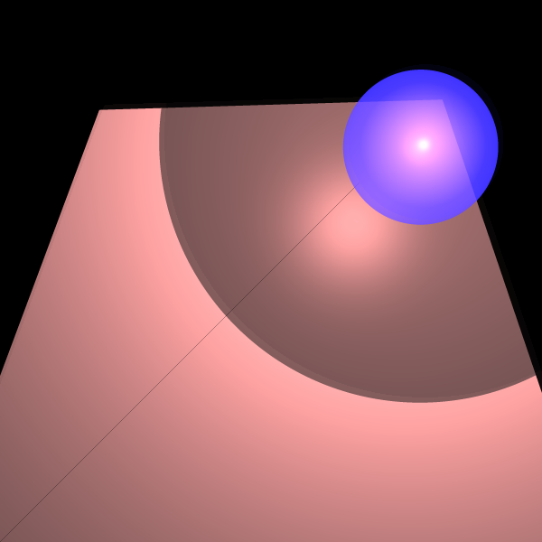
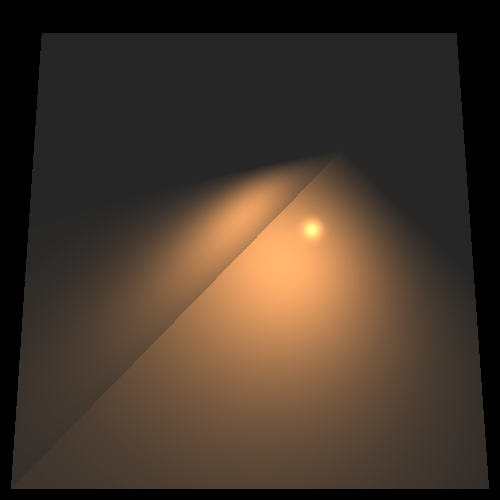
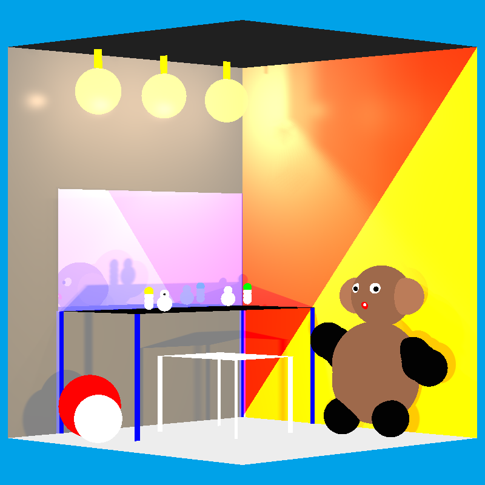

# Java Ray Tracer

A 3D ray tracer implemented from scratch in Java, developed as a joint Software Engineering course project by **Noa Aizen** and **Noga Jacobs**. It uses no graphics libraries: rays, intersections, lighting and pixels are all computed by the project's own code.

<p align="center">
  
</p>

## Features

- **Geometry:** ray intersection for spheres, planes, triangles, polygons and circles
- **Lighting:** ambient, directional, point (distance attenuation) and spot lights
- **Shading:** Phong model with diffuse, specular, shininess and emission
- **Shadows:** hard shadows, lighter shadows behind transparent objects, and optional soft shadows
- **Global effects:** recursive reflection and transparency, with a depth limit and a contribution cutoff
- **Image quality:** anti-aliasing (multiple rays per pixel) and adaptive super sampling that subdivides only pixels whose samples differ
- **Performance:** multithreaded rendering with a shared pixel work queue and a progress indicator
- **Scenes:** fluent Java builder API, plus basic XML scene loading
- **Tests:** JUnit 5 tests for the math core and intersection algorithms

## How It Works

1. `Camera` casts a ray through each pixel (or several rays per pixel, when sampling is enabled).
2. `RayTracerBasic` finds the closest intersection among the scene's geometries.
3. Local effects add emission and, for each light, diffuse and specular terms, scaled by a shadow-ray transparency factor.
4. Global effects trace reflected and transmitted rays recursively, up to 10 levels, stopping early when the contribution drops below 0.001.
5. `ImageWriter` writes the final colors to a PNG.

| Package | Responsibility |
|---|---|
| `primitives` | `Point`, `Vector`, `Ray`, `Color`, `Material`, and floating-point helpers |
| `geometries` | `Intersectable` base class, the `Geometries` composite, and the shapes |
| `lighting` | Ambient, directional, point and spot lights |
| `renderer` | `Camera`, `RayTracerBasic`, `ImageWriter`, and `Pixel` (thread work distribution) |
| `Scene`, `parser` | `Scene` with its `SceneBuilder`, and the XML scene descriptor |

Design patterns used: Builder (`SceneBuilder`), Composite (`Geometries`), Template Method (`findGeoIntersections` → `findGeoIntersectionsHelper`), and fluent setters.

## Example Renders

| Without improvements | Soft shadows and anti-aliasing |
|---|---|
|  |  |

| Reflection | Transparency and shadow | Spot light | Soft shadows |
|---|---|---|---|
|  |  |  |  |

## Running

There is no build tool yet. The project targets **Java 17**, and the JUnit 5 jars are in `lib/`. In IntelliJ IDEA:

1. Open the folder as a project.
2. Mark `src/` as *Sources Root* and `unitTests/` as *Test Sources Root*.
3. Add `lib/` as a project library.
4. Run a test class. Renders are written to `images/`.

## Testing

`unitTests/` contains 53 JUnit 5 test methods:

- **Math core:** `VectorTest` and `PointTest`.
- **Geometry:** `SphereTest`, `PlaneTest`, `TriangleTest`, `PolygonTests`, `TubeTest` and `GeometriesTests`, covering normals and intersections with equivalence-partition and boundary cases.
- **Camera:** `CameraTests` and `IntegrationTests` check ray construction and intersection counts.
- **Rendering:** the rendering tests generate images for visual inspection. They do not assert on pixel values.

## Project Structure

```
src/         primitives, geometries, lighting, renderer, Scene, parser
unitTests/   JUnit 5 tests
lib/         JUnit 5 jars
docs/images/ showcase renders
images/      render output (git-ignored)
```

## Known Limitations

This project was developed as an academic Software Engineering project and some components remain incomplete:

- Tube and Cylinder ray intersections are not implemented.
- Some rendering and sampling components have known limitations that can be improved in future iterations.
- Some original course tests require environment-specific adjustments.
- The project currently uses local JUnit dependencies rather than Maven or Gradle.

## Credits

- **Noa Aizen** and **Noga Jacobs**: design and implementation, developed together.
- **Dan Zilberstein** (course lecturer): the course starter code, including `Main.java`, the original `Polygon` class, and the base test scenes in `PolygonTests`, `CameraTests`, `RenderTests`, `LightsTests`, `ShadowTests` and `ReflectionRefractionTests`, which the authors extended.

Created for the Introduction to Software Engineering course.
